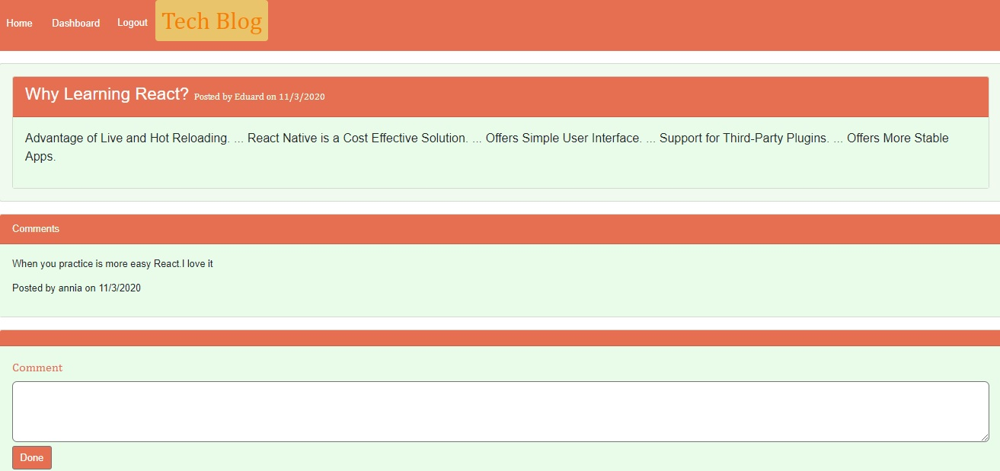

# TECH BLOG

  

# Description

Tech Blog is an application where developers can post their technology knowledge on the blog to share with others. Users can authenticate to post, comment on other developers' posts, edit and delete their own posts.

  
  
 
 _____________________________________________________________________
 Visit the site! [Tech Blog](https://developertechblog.herokuapp.com/)

# Table of Contents

[Installation](#Installation)

[Usage](#Usage)

[License](#License)

[Technologies](#Technologies)

[Questions](#Questions)

  
# Installation 

- You need to clone the project in your pc `git clone <addres for the project from github>`.
- You need to have the local database installed for mysql,`create a file call .env with this data
`DB_NAME='<database name>'`
`DB_USER='root'`
`DB_PW='password database'`
- Open the project terminal from the server file and write the command `npm install and then npm start`. In the browser write  `http: // localhost: 3001`. 

# Usage 

- When you open the application you can see the publications with they comments and select the one you want to see.
- To publish you need to click on login and sipnup if it is your 1st time with the app.
- Once registered you can create publications, edit or delete from Dashboard.

Screenshot for create a post.

Screenshot for edit and delete a post.

Screenshot for add comments.

# License
The license for which the application is covered:
NONE 

# Technologies 
* NODE
* EXPRESS
* MYSQL
* SEQUELIZE
* HANDLEBARS
* BCRYPT
* DOTENV
* HEROKU

# Questions

  If you have questions about the project, below you can find ways to answer them, either by visiting my highub or contacting me by email
  
  Link to my Github: [anniavd](https://github.com/anniavd)

  
  Email acount: [annia.valded@gmail.com](mailto:annia.valded@gmail.com)
    

